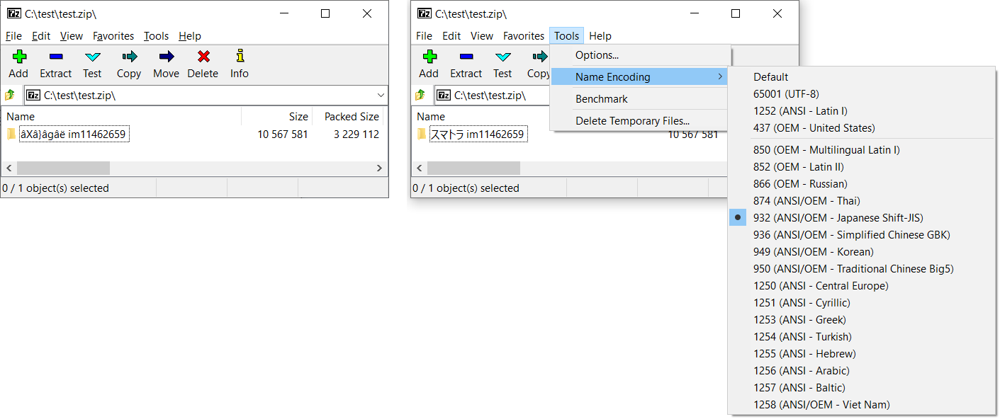

## 🛠 7-Zip fork with Codepage selection patch

This patch adds an **easy way to change the codepage** directly from the **Tools → Name Encoding** menu in 7-Zip File Manager.  
It solves the problem of garbled filenames ([mojibake](https://en.wikipedia.org/wiki/Mojibake)) when extracting archives made with a different encoding.

---

### 📸 Screenshot

---

## 📥 Installation
1. **Download** the patched `7zFM.exe` from this repository's [Releases](https://github.com/Autori/7zip-codepage/releases) page.
2. **Find your 7-Zip installation folder**, e.g.  
   - `C:\Program Files\7-Zip` (64-bit version)  
   - `C:\Program Files (x86)\7-Zip` (32-bit version)
3. **Pick the correct file**:  
   - If you have **64-bit 7-Zip**, use the **x64** patched file.  
   - If you have **32-bit 7-Zip**, use the **x86** patched file.
4. **Replace the existing `7zFM.exe`** with the patched one.
5. **Restart** 7-Zip File Manager.

---

## 💡 How to use
1. Open 7-Zip File Manager.
2. Go to **Tools → Name Encoding**.
3. Select the encoding that matches the archive's filenames.
4. Extract your files - the names should now display correctly.
**Note:** The choice is remembered until you close the app. If you want the setting to persist - please read a section below.

---

## 🔍 For developers / technical explanation
- This patch adds a **environment variable `Z7_FORCE_CODEC`** that stores the selected codepage.
- The environment variable is read in both:
  - `Agent.cpp` - affects opening archives directly.
  - `ExtractCallback.cpp` - affects extraction behavior.
- The **codepage** is set via `ISetProperties` with the `"cp"` property before archive reading.
- The UI changes:
  - Adds a **"Name Encoding"** submenu to **Tools** in `resource.rc`.
  - Defines menu IDs for each supported codepage in `resource.h`.
  - Implements selection logic in `MyLoadMenu.cpp`:
    - Updates menu checkmarks to reflect the current codepage.
    - Saves/removes `Z7_FORCE_CODEC` with `_putenv_s` when the user changes it.
- **Persistence:**  
  - The codepage setting lasts only until the 7-Zip File Manager process exits.  
  - It is not written to a configuration file and must be set again next time you open 7-Zip.
  - You can set the environment variable in your system settings and that way it would be persistent. (`Z7_FORCE_CODEC=932` will set codepage for Japanese Shift-JIS)

---

### 🔗 References
These discussions provided useful information and background for this patch:  
- [rikyoz/bit7z issue #248](https://github.com/rikyoz/bit7z/issues/248)  
- [rikyoz/bit7z issue #267](https://github.com/rikyoz/bit7z/issues/267)

---

## 💰 Donations
If this patch helped you, consider supporting me via crypto:  

- **Bitcoin (BTC)**: `1PRRRYXpVE3wZR4UR3ANDysJecoHNDFakq`
- **Bitcoin Cash (BCH)**: `1PRRRYXpVE3wZR4UR3ANDysJecoHNDFakq`
- **Ethereum (ETH)**: `0x5c1d86b956319f4a3fdea47be6bf3e3280e925ad`

---

# 7-Zip on GitHub
7-Zip website: [7-zip.org](https://7-zip.org)
